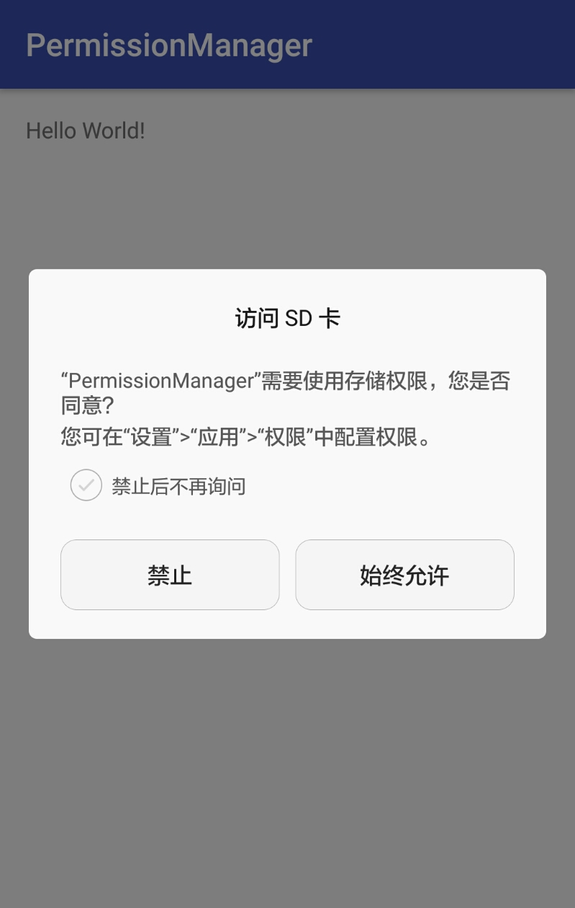

[  ](https://bintray.com/zengyuzhan/maven/permission/1.0.0/link)

在**android6.0之前**，当我们需要使用到存储权限时（如创建目录，保存图片等操作），我们**只需要在AndroidManifest.xml中申明权限即可**。

但是在**android6.0之后**，**除了在AndroidManifest.xml中申明权限之外**，我们还**需要在代码中动态申请权限，让用户确认才可以**。

这对于**刚刚接触android6.0的开发者来说就是一个坑**。

有时候在之前的手机上正常运行的应用，在新手机上就出现各种莫名其妙的问题，因此为了不让更多人掉坑里，我这里分享一下我权限申请的步骤。

这里面的工具相关的代码也是参考之前github上别人分享的，不过他的代码太过复杂，所以我这里抽取出来并且以实际demo的形式来演示如何动态申请权限，供大家参考。

**导入包：**
```
implementation 'com.zengyu:permission:1.0.0'
```

**使用步骤：**  
1. 定义PermissionHelper变量。  
2. 在需要检查权限的地方调用doPermissionCheck()方法。  
3. 实现OnPermissionCallback回调接口。  
4. 在实现的回调方法里面做各自的事情。具体可以看注释。也可以通过添加日志的方式来观察。

**__欢迎star和follow__**。  




[参考的原github传送门](https://github.com/k0shk0sh/PermissionHelper)


